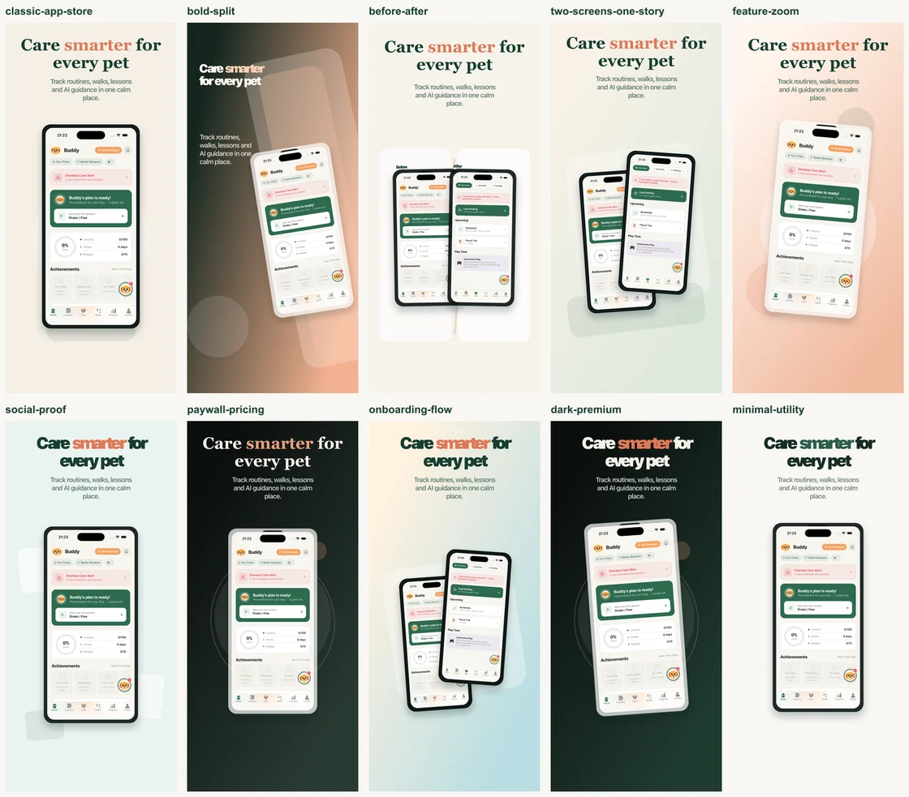
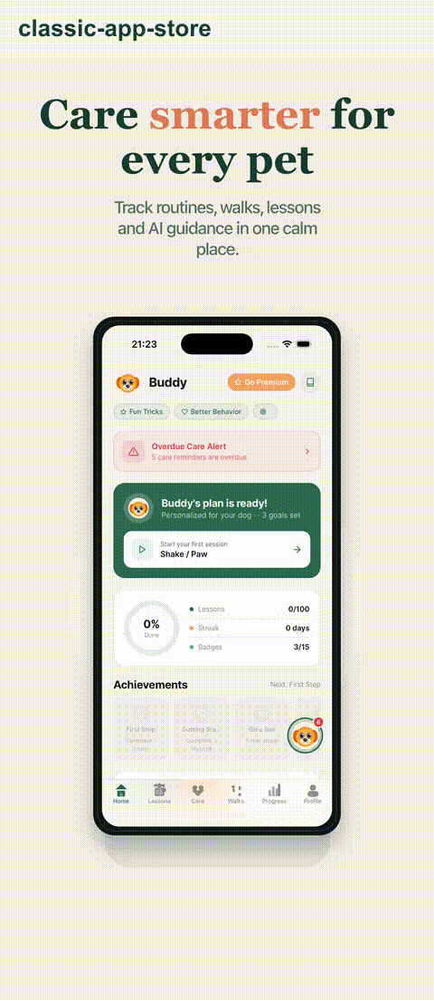
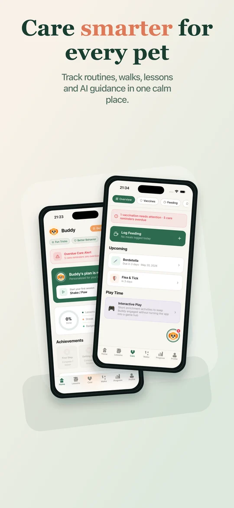
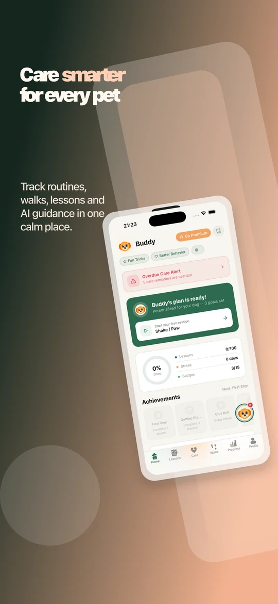
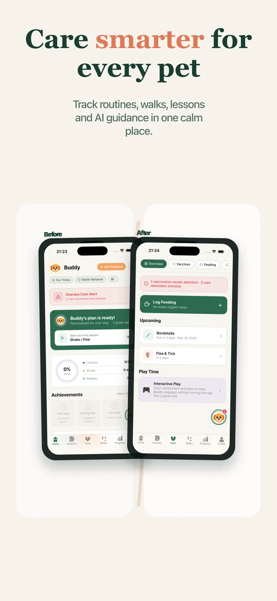

# Shotwise

Open-source, local-first App Store and Play Store screenshot builder.


Shotwise helps you turn real app screenshots into store-ready visuals with templates, multi-screen layouts, visual device previews, locale-aware copy, and clean PNG/ZIP exports. The default open-source path runs locally with no account, no billing, no hosted storage, and no generation keys.

Use it as an open-source alternative for creating App Store screenshots, Google Play screenshots, iPhone mockups, Android phone mockups, iPad screenshots, localized store assets, product screenshots, and launch graphics directly from your browser.



## What It Is

Shotwise is being built around one practical promise:

> Design beautiful store screenshots locally, then export production-ready assets without needing Figma or a hosted account.

The current product direction is:

- **Local-first**: `/studio` works in the browser without accounts, backend services, payment setup, or seed users.
- **Template-first**: users start from real reusable scene templates, not just color presets.
- **Manual-first**: every important design surface is edited directly in Studio.
- **Skill-friendly**: coding agents can follow `SKILL.md` to prepare scenes, translations, and export-ready assets outside the app.
- **Export-quality-focused**: static store screenshots should be excellent before animation/video becomes a priority.

## Why People Search For This

Shotwise is for teams and indie developers who need:

- App Store screenshot generator
- Google Play screenshot generator
- iPhone screenshot mockup tool
- Android screenshot mockup tool
- iPad and tablet screenshot templates
- localized app store screenshots
- mobile app marketing screenshots
- ASO screenshot design
- open-source screenshot editor
- local-first screenshot builder
- no-login screenshot export
- PNG and ZIP screenshot exports

## Current Highlights



- Local Studio at `/studio`
- IndexedDB project storage
- Local screenshot blob storage
- Static template registry with 20+ starter templates
- Color theme swatches
- One-screen and two-screen scene templates
- Two screenshots in one canvas
- Per-slot source, fit, width, zoom, rotation, and label controls
- Visual iPhone, iPad, Android phone, foldable, and tablet device picker
- Grid or tabbed multi-device live preview
- Per-device frame, status bar, slot scale, and text scale controls
- PNG export
- ZIP export
- Stable export naming
- Root `SKILL.md` for vibe-coding local screenshot production

## Quick Start

```bash
pnpm install
pnpm --filter @shotwise/web dev
```

Then open:

```text
http://localhost:3000/studio
```

If port `3000` is busy:

```bash
pnpm --filter @shotwise/web exec next dev -p 3001
```

Then open:

```text
http://localhost:3001/studio
```

Start in Studio, pick a template, edit copy, choose locales/devices, and export.

## GitHub Topics

Suggested repository topics:

```text
app-store-screenshots, google-play-screenshots, screenshot-generator, screenshot-editor,
app-store-optimization, aso, ios-screenshots, android-screenshots, iphone-mockup,
ipad-screenshots, play-store-assets, local-first, nextjs, typescript, sharp
```

## Local Studio Workflow

### 1. Start From A Template

Open `/studio` and choose **Start from template**. The Studio creates a local project in your browser.

Templates define:

- canvas layout
- background treatment
- screenshot slots
- device frame style
- text hierarchy
- export defaults
- preview metadata



### 2. Add Screenshots

Use **Drop or choose screenshots** to add PNG, JPEG, or WebP app screenshots. Files stay in the browser for local mode.

The first uploaded screenshot fills the first slot automatically. Two-slot templates use the first two screenshots when available.

### 3. Pick A Template

Use the template gallery on the left. Filters let you narrow by category and slot count.

Bundled template families include:

- Classic App Store
- Bold Split
- Before / After
- Two Screens One Story
- Feature Zoom
- Social Proof
- Paywall / Pricing
- Onboarding Flow
- Dark Premium
- Minimal Utility
- Glass Duo
- Editorial Feature
- Android Showcase
- Tablet Command
- Paywall Glow
- Social Stats
- Playful Cards
- Comparison Ribbon
- Fintech Sharp
- Wellness Warm



### 4. Move Screens On The Canvas

Click a screenshot slot on the canvas, then drag it into position.

Use this for:

- aligning two screens into one story
- making a before/after comparison feel connected
- pushing a phone into a more dramatic crop
- creating App Store-style angled layouts

### 5. Tune The Selected Slot

Use the inspector on the right:

- **Screenshot source**: choose which uploaded screenshot fills the selected slot
- **Next source**: quickly cycle through uploaded screenshots
- **Swap pair**: swap two screenshot sources in two-slot templates
- **Fit**: choose contain or cover
- **Width**: resize the device slot
- **Zoom**: scale the screenshot within its scene placement
- **Rotation**: angle one screen independently
- **Label**: add optional before/after or step labels



### 6. Pick Devices Visually

Use **Export devices** to choose device previews from visual cards:

- iPhone sizes
- iPad sizes
- Android phones
- Android foldable/tablet presets

Pick one device to work in a focused preview, or select several devices and switch the canvas between **Grid** and **Tabs**. Grid splits the live preview into one tile per selected device; Tabs lets you tune a single selected device without losing the export set.

### 7. Tune Each Device

Use **Active device tuning** for the selected device:

- Bezel
- Glass
- Minimal
- None
- Hide status bar for that device
- Device slot scale
- Text scale

The same scene model powers the client preview and server-side render path, so local preview and export should stay aligned.

### 8. Export

Use the top-right export buttons:

- **PNG**: render the current scene as a single image
- **ZIP**: render all selected locale and device preset combinations
- **Export JSON**: save a portable local project description

Export naming is stable:

```text
project/template/locale/device/screen-name.png
```

Example:

```text
petwise/two-screens-one-story/tr/iphone69/home.png
```

Use **Export file name** in the inspector to control `screen-name`.

### 9. Localize

Use **Editing locale** to switch the copy panel between languages. Use **Export locales** to choose which locale folders are included in the ZIP.

The exported ZIP groups files by locale and device, so a Turkish iPhone render and a German iPad render do not overwrite each other.

## SKILL.md Workflow

Shotwise includes a root [SKILL.md](SKILL.md) so coding agents can use the project directly during vibe coding. The app itself stays manual: there is no in-app generation setup.

Example user prompt:

```text
My screenshots are in ./screenshots.
Prepare App Store screenshots for English, Turkish, and German.
Use Two Screens One Story, name the output home, and export iPhone, iPad, and Android assets.
```

The agent should:

- inspect the screenshot folder
- pick a template from `apps/web/src/lib/templates.ts`
- write localized copy into `project.localized`
- set `project.exportConfig.locales`
- set `project.exportConfig.devicePresetIds`
- set `project.screenName`
- visually check `/studio`
- export ZIP paths like `petwises/two-screens-one-story/tr/iphone69/home.png`

The test suite includes a deterministic SKILL workflow test, so this path is checked without requiring a network service.

## Competitive Feature Backlog

These came out of comparing Shotwise against Appshots, Sleek, before.click, Shots.so, ezscreenshots-style inspiration pages, and real App Store screenshot sets.

Implemented in the current local Studio pass:

- Local no-login Studio
- Template registry
- Two screenshot slots in one scene
- Two-screen templates
- Per-slot controls
- Local PNG/ZIP export foundation
- SKILL.md workflow docs and tests
- Runtime seed/mock data cleanup path

Still next:

- Full screenshot-set storyboard editor for 5-10 screens
- App Store strip preview so users see the whole set side by side
- Inspiration gallery with category, platform, funnel stage, and use-case filters
- “Copy composition from inspiration” template mapping
- Brand-aware palette extraction from uploaded screenshots
- Magic background generator
- Built-in callout, zoom lens, and highlight controls
- Per-screen copy suggestions and consistency checks
- Batch apply template/style across all screens
- Multi-locale review grid
- Feature graphic editor
- Animation/video export after static screenshot quality is strong
- App Store / Play Console upload integrations later

## Architecture

```text
shotwise/
├── apps/
│   └── web/                   # Next.js app: marketing and local Studio
├── packages/
│   ├── core/                  # Scene model, device presets, and render utilities
│   ├── types/                 # Shared TypeScript types
│   └── ui-primitives/         # Shared UI components
├── assets/                    # README/demo assets
└── SKILL.md                   # Agent workflow for vibe-coding screenshot sets
```

## Development Commands

```bash
pnpm install
pnpm --filter @shotwise/web dev
pnpm --filter @shotwise/web typecheck
pnpm --filter @shotwise/core typecheck
pnpm --filter @shotwise/web test
```

Useful local URLs:

- `http://localhost:3000` - Next.js dev server
- `http://localhost:3000/studio` - no-login local Studio

## Testing

Recommended checks for Studio/template work:

```bash
pnpm --filter @shotwise/web typecheck
pnpm --filter @shotwise/core typecheck
pnpm --filter @shotwise/web test -- src/lib/templates.test.ts src/lib/local-export.test.ts src/lib/skill-workflow.test.ts src/app/studio/studio-client.test.tsx
```

Broader checks:

```bash
pnpm typecheck
pnpm test
pnpm --filter @shotwise/web smoke
```

## Open-Source Status

Shotwise is being prepared as a real public repo.

- License: `MIT`
- Code of conduct: [CODE_OF_CONDUCT.md](CODE_OF_CONDUCT.md)
- Contributing guide: [CONTRIBUTING.md](CONTRIBUTING.md)
- Security reporting: [SECURITY.md](SECURITY.md)

The default public demo path should remain `/studio`: local, useful, and open without a hosted account.
